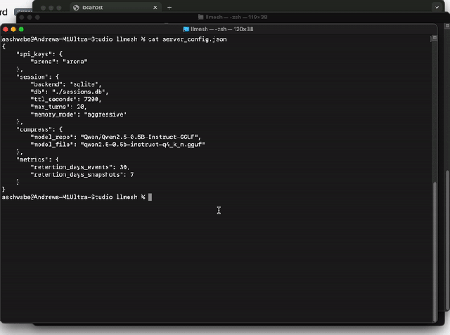

# LLMesh Hub & Agent

LLMesh is a distributed workload orchestration system that routes AI inference tasks to a decentralized network of compute nodes based on hardware fitness and availability. This project establishes the foundation for managing robust, intelligent workloads across multiple environments.



## Core Project Components

Based on our recent implementation phases, the system is designed around two primary components:

1. **Hub (`lib/hub/`)**: A FastAPI-based central orchestrator. It manages node registrations, tracks active hardware resources, queues inference requests, and dynamically routes those tasks to the optimal available node. It also provides a web-based dashboard for real-time monitoring of tasks and connected nodes.
2. **Agent (`lib/agent/`)**: A lightweight Python client running on contributor or execution machines. The agent detects locally running inference backends (Ollama, and optionally vLLM/MLX), registers hardware capabilities and available models with the Hub, maintains a heartbeat, and continuously polls for tasks. Upon receiving a task it dispatches to the appropriate local backend and transmits the result back to the Hub.

Our project history reflects ongoing architectural evolution, particularly focusing on migrating from a single-owner MVP model to a scalable, multi-tenant SaaS architecture.

## Getting Started

### Prerequisites

- Python 3.10+
- [Ollama](https://ollama.com/) running locally (if running an agent node)

### Installation

1. Clone the repository and navigate to the project root:
   ```bash
   cd llmesh
   ```
2. Create and activate a virtual environment:
   ```bash
   python -m venv .venv
   source .venv/bin/activate
   pip install --upgrade pip
   ```
3. Install LLMesh. Pick the install profile that matches your role:

   **Hub or headless agent (server / Linux deployment):**
   ```bash
   pip install .
   ```
   Installs only what the FastAPI hub and the polling agent need. No GUI, no
   PyInstaller, no macOS-specific packages — safe on Linux servers and inside
   containers.

   **Desktop tray client (macOS / Windows developer machine):**
   ```bash
   pip install '.[desktop]'
   ```
   Adds `pystray` + `Pillow` and the macOS-only `pyobjc-*` packages (gated by
   platform markers, so the same command is harmless on Linux).

   **Building the desktop binary (PyInstaller):**
   ```bash
   pip install '.[desktop,build]'
   ```

   **Running the test suite:**
   ```bash
   pip install '.[dev]'
   ```

4. **Install git hooks** — Ledger Law check + gitleaks secrets scan:
   ```bash
   bash scripts/install_git_hooks.sh
   ```
   Pre-commit will refuse to run without `gitleaks` installed locally. On macOS:
   ```bash
   brew install gitleaks
   ```
   See `.qcoda/CONVENTIONS.md` § Enforcement for the full hook details.

### 1. Start the LLMesh Hub

The Hub uses FastAPI and Uvicorn. Copy the provided example config and edit it with your own API keys:

```bash
cp server_config.example.json server_config.json
```

At minimum you need one API key mapped to an owner ID. The value is your chosen identifier for that owner — it can be any string:

```json
{
    "api_keys": {
        "your-secret-key-here": "owner_alpha"
    }
}
```

`server_config.json` is excluded from version control — it stays local to your deployment.

To start the server:

```bash
    uvicorn lib.hub.server:app --reload --port 8000
```
- The API will be available at `http://localhost:8000`
- Access the web dashboard at `http://localhost:8000/dashboard`

### 2. Start an Agent (Node)

Each agent node registers available models with the Hub. **Ollama is enabled by default.** vLLM and MLX are opt-in — set `VLLM_HOST` or `MLX_HOST` to enable them. Three backends are supported:

| Backend | Platform | Default port | Detection |
|---|---|---|---|
| **Ollama** | Any | `11434` | `GET /` + `GET /api/tags` |
| **vLLM** | Linux (GPU) | `8000` | `GET /health` + `GET /v1/models` |
| **MLX** | macOS (Apple Silicon) | `1337` | `GET /` + `GET /v1/models` |

A node can run any combination of these simultaneously. Models from all active backends are pooled and available for routing.

#### Backend support tiers

| Tier | Backend | Notes |
|---|---|---|
| **Full** | Ollama | Fully supported. Real token streaming (SSE). Tested end-to-end. Recommended for all deployments. |
| **Beta** | vLLM | Inference works (blocking; streaming falls back). GPU/Linux. Auth-protected endpoints supported via `VLLM_API_KEY` (D014). Context window auto-detected from `max_model_len` in `/v1/models` (D015). LiteLLM Proxy compatibility via the same backend — see [docs/integrations/litellm.md](docs/integrations/litellm.md). |
| **Beta** | MLX | Partial support. Inference works; streaming falls back to blocking mode. macOS Apple Silicon only. Less tested. |

vLLM and MLX support is functional but not streaming-optimised. If you hit issues with these backends, please open an issue. Streaming support for vLLM and MLX is on the roadmap.

Configure the agent to authenticate with the Hub using your API key. You can set it up in two ways:

#### Option A: Terminal / CLI
Set your environment variables (API key, Hub URL, and optional context window) inline or via a `.env` file:
```bash
LLMESH_API_KEY="your-api-key" HUB_URL="http://127.0.0.1:8000" OLLAMA_NUM_CTX=32768 python -m lib.agent.client
```

#### Option B: Standalone Desktop App (macOS / Windows)
LLMesh includes a cross-platform system tray application that runs the agent purely in the background (via macOS Menubar or Windows Taskbar) without requiring an open terminal window.
- Please refer to the [Desktop Agent Build Guide](docs/desktop_client.md) for instructions on how to compile the native `.app` or `.exe` via PyInstaller.

> **Agent Configuration**: Customize connectivity and inference behaviour via environment variables or a local `.env` file:
>
> | Env var | Default | Description |
> |---|---|---|
> | `HUB_URL` | `http://127.0.0.1:8000` | Hub address the agent registers with |
> | `LLMESH_API_KEY` | — | API key for authenticating with the hub |
> | `LLMESH_NODE_ID` | _(auto-fingerprint)_ | Optional human-readable node ID (e.g. hostname). Default is the salted-hash fingerprint `node_<16hex>` (D021). Set to a label like `gpu-host-1` to make logs and the dashboard show which machine is which. Must match `[a-zA-Z0-9][a-zA-Z0-9_.-]{0,63}`. Operator owns collision avoidance — same value on two agents = second inherits first's token. See decisions.md D048. |
> | `OLLAMA_NUM_CTX` | `8192` | Context window passed to Ollama on every inference call. Also used as the fallback `context_size` reported to the hub when vLLM is the only active backend and its window is unknown. |
> | `VLLM_HOST` | _(disabled)_ | Base URL for an OpenAI-compatible vLLM server (or any compatible endpoint — host and port, optionally a path subroute, e.g. `http://gpu.internal:8001` or `https://proxy.example.com/litellm`). Set to enable the vLLM backend. |
> | `VLLM_API_KEY` | _(none)_ | Optional bearer token attached to every request against `VLLM_HOST`. Plain local vLLM does not need this; set it for hardened reverse-proxied vLLM or LiteLLM Proxy. See [docs/integrations/litellm.md](docs/integrations/litellm.md). |
> | `VLLM_HEALTH_PATH` | `/health` | Path the agent probes for vLLM liveness. LiteLLM users should set this to `/health/liveliness` because LiteLLM's `/health` runs a real upstream model probe and is too heavy for a 2-second liveness check. |
> | `VLLM_MAX_CONTEXT` | _(auto-detect)_ | Optional explicit override for the vLLM context window the agent reports to the hub. By default the agent auto-detects this from `max_model_len` in vLLM's `/v1/models` response. Set this when running behind a proxy that strips the field, or to clamp the advertised window below the model's actual capability. |
> | `VLLM_STREAMING_ENABLED` | `true` | Master gate for vLLM real per-token streaming (D040 implementation, default flipped ON in D044 after operator verification). Set to `false` to fall back to the blocking + D018 bridge path (single-frame SSE delivery). |
> | `MLX_HOST` | _(disabled)_ | Base URL for a local MLX server. Set to enable MLX backend. |
> | `OLLAMA_PARALLEL_SLOTS` | _(auto)_ | Override auto-detected concurrent inference slot count |
> | `STREAM_BATCH_FIXED` | _(unset)_ | Pin the agent's stream-batch size to a fixed N and disable adaptive auto-tune. Useful for load testing (`=1`), debug (`=1`), conservative production (`=20`), or pre-characterized fast clusters (`=50`). See `STREAM_BATCH_*` in `.env.example` and decisions.md D041 for the full set of adaptive batching tunables (`STREAM_BATCH_INITIAL`, `STREAM_BATCH_TIME_MS`, `STREAM_BATCH_TARGET_PPS`, `STREAM_BATCH_MIN`, `STREAM_BATCH_MAX`, `STREAM_BATCH_MAX_BUFFER`). |

#### Backend setup notes

**vLLM (Linux GPU)**

Start vLLM with an OpenAI-compatible server. The agent expects `/health` (or whatever you set `VLLM_HEALTH_PATH` to) and `/v1/models` to be reachable at `VLLM_HOST`. Pick a port that does **not** collide with the LLMesh hub (default `8000`):

```bash
python -m vllm.entrypoints.openai.api_server \
    --model meta-llama/Llama-3-8B-Instruct \
    --port 8001 \
    --max-model-len 32768
```

`--max-model-len` is the entire context window (prompt + completion) and is fixed for the lifetime of the vLLM process — it determines how much KV-cache memory vLLM allocates at startup. The agent auto-detects this value from the `max_model_len` field on each model card in vLLM's `/v1/models` response and reports it to the hub as the node's `context_size`, so the routing layer makes correct decisions for vLLM-backed nodes .

vLLM is only enabled when `VLLM_HOST` is set. The host can include a port and an optional path subroute:

```bash
VLLM_HOST=http://127.0.0.1:8001 LLMESH_API_KEY="..." python -m lib.agent.client
```

**Context window resolution priority** (highest first):
1. `VLLM_MAX_CONTEXT` env var — explicit operator override. Use this when your endpoint is behind a proxy that strips `max_model_len` from `/v1/models` (some LiteLLM configurations) or when you want to clamp the advertised window below the model's actual capability for routing purposes.
2. `max_model_len` auto-detected from `/v1/models` — zero operator config, self-corrects when you restart vLLM with a different `--max-model-len`. The path to prefer for vanilla vLLM.
3. `OLLAMA_NUM_CTX` — conservative legacy fallback. The agent prints a warning at registration if this fallback is used on a vLLM node.

**Per-request `num_ctx` override is Ollama-only.** A client request asking the hub for a smaller window than vLLM is configured for is silently ignored on the vLLM path — the OpenAI Chat Completions API has no field for context-window override and vLLM's window is fixed at server startup. If you need a smaller window on vLLM, restart vLLM with a smaller `--max-model-len`. 
**Auth-protected vLLM (or LiteLLM Proxy):** set `VLLM_API_KEY` to attach a bearer token to every request the agent makes against `VLLM_HOST`, and (for LiteLLM specifically) set `VLLM_HEALTH_PATH=/health/liveliness`. Full integration guide in [docs/integrations/litellm.md](docs/integrations/litellm.md).

**MLX (macOS Apple Silicon)**

Any OpenAI-compatible MLX server (e.g. osaurus) on port `1337` by default. The agent uses `GET /` as a health check and `GET /v1/models` to list available models. MLX is only enabled when `MLX_HOST` is set:

```bash
MLX_HOST=http://localhost:1337 LLMESH_API_KEY="..." python -m lib.agent.client
```

### 3. Optional: Session Memory & Configuration

The Hub maintains per-session conversation history so clients do not need to resend the full message history on every turn. History is stored in a local `sessions.db` SQLite file (created automatically — no setup needed).

**How it works**: Include an `X-Session-ID` header in your requests. The Hub returns the assigned session ID in the same response header:

```bash
# First request — hub generates a session ID
curl -X POST http://localhost:8000/v1/chat/completions \
     -H "Authorization: Bearer my_secret_key_1" \
     -H "Content-Type: application/json" \
     -d '{"model": "llama3.2:3b", "messages": [{"role": "user", "content": "Hello!"}]}'
# Response includes: X-Session-ID: <uuid>

# Subsequent requests — pass the ID to continue the conversation
curl -X POST http://localhost:8000/v1/chat/completions \
     -H "Authorization: Bearer my_secret_key_1" \
     -H "X-Session-ID: <uuid-from-previous-response>" \
     -H "Content-Type: application/json" \
     -d '{"model": "llama3.2:3b", "messages": [{"role": "user", "content": "What did I just say?"}]}'
```

All session settings are optional and can be placed in `server_config.json` or set as environment variables (env vars take precedence):

```json
{
    "api_keys": { "my_secret_key_1": "owner_alpha" },
    "session": {
        "backend": "sqlite",
        "db": "./sessions.db",
        "ttl_seconds": 7200,
        "max_turns": 20,
        "memory_mode": "aggressive"
    },
    "compress": {
        "model_repo": "Qwen/Qwen2.5-0.5B-Instruct-GGUF",
        "model_file": "qwen2.5-0.5b-instruct-q4_k_m.gguf"
    }
}
```

**Session settings**

| `server_config.json` key | Env var | Default | Description |
|---|---|---|---|
| `session.backend` | `SESSION_BACKEND` | `sqlite` | `sqlite` or `postgres` |
| `session.db` | `SESSION_DB` | `./sessions.db` | SQLite file path, or `:memory:` |
| `session.ttl_seconds` | `SESSION_TTL_SECONDS` | `7200` | Seconds before inactive sessions are evicted |
| `session.max_turns` | `SESSION_MAX_TURNS` | `20` | Turn count that triggers history compression |
| `session.memory_mode` | `SESSION_MEMORY_MODE` | `aggressive` | `aggressive`, `balanced`, or `cutoff` |

**Compression model** (in-process, no Ollama required)

On first startup, the hub downloads a small GGUF model (~300 MB) from HuggingFace and loads it into memory. The server does not accept requests until the model is ready. The model is cached in `~/.cache/huggingface/hub/` — subsequent restarts load from disk in seconds.

| `compress.model_repo` | `COMPRESS_MODEL_REPO` | `Qwen/Qwen2.5-0.5B-Instruct-GGUF` | HuggingFace repo ID |
| `stream.chunk_timeout` | `STREAM_CHUNK_TIMEOUT` | `120.0` | Max seconds between tokens before timeout |
| — | `MODELS_CACHE_TTL` | `10.0` | Seconds to cache `GET /v1/models` per owner. `0` disables. See D027. |
| — | `MAX_INPUT_BYTES` | `262144` | Max bytes per chat message content / per embedding input string. Overflow → 413 (structured `error` body). See D032 / D049. |
| — | `MAX_MESSAGES` | `200` | Max messages per chat request. Overflow → 413. See D032 / D049. |
| — | `MAX_BATCH_EMBEDDINGS` | `128` | Max input strings per `/v1/embeddings` request. Overflow → 413. See D032 / D049. |
| — | `STREAM_QUEUE_MAX` | `256` | Bounded SSE chunk queue size (drop-oldest on overflow). See D033. |
| — | `DEFAULT_EMBEDDING_MODEL` | `nomic-embed-text` | Model used when `/v1/embeddings` omits `model`. See D028. |
| — | `LLMESH_CONFIG_PATH` | _(repo root `server_config.json`)_ | Override path to the hub config file (used by the test suite). |
| `compress.model_file` | `COMPRESS_MODEL_FILE` | `qwen2.5-0.5b-instruct-q4_k_m.gguf` | GGUF filename within that repo |
| `compress.context_size` | `COMPRESS_MODEL_CTX` | `4096` | Context window (tokens) |
| `compress.n_threads` | `COMPRESS_N_THREADS` | _(CPU count)_ | CPU threads for inference |

The default model is **Qwen2.5-0.5B-Instruct** (Q4_K_M, Apache 2.0). It runs on CPU only and requires ~500 MB RAM. Set `SESSION_MEMORY_MODE=cutoff` to disable compression entirely — the model will not be downloaded.

**Compression modes**:
- `aggressive` (default) — summarizes all prior history into a single system message; keeps only the last 2 turns verbatim. Minimum token footprint.
- `balanced` — compresses the older half of the conversation; keeps the newer half verbatim.
- `cutoff` — no LLM summarization; oldest messages are dropped when the cap is hit. Zero compute cost; model not downloaded.

Compression runs as a background task — no added latency to the caller. Each compression call is logged in `inference_events` with `is_compression=1` so it appears as a separate series in the Stats dashboard without skewing user call counts.

See [docs/memory.md](docs/memory.md) for full details, and [docs/postgres.md](docs/postgres.md) for the optional PostgreSQL backend.

### 4. Optional: Ollama context window (`OLLAMA_NUM_CTX`)

When Ollama runs a model, it allocates a KV cache sized to the context window at load time. The default context window is **4096 tokens**, regardless of what the model was trained on. Models trained on larger contexts (e.g. 32768 tokens for Llama 3) produce a log warning:

```
llama_context: n_ctx_per_seq (4096) < n_ctx_train (32768)
-- the full capacity of the model will not be utilized
```

This is not a crash — inference still works — but it means the model cannot attend to more than 4096 tokens of input at once. Long prompts, multi-turn conversations, or document-grounded queries will silently truncate if they exceed this limit.

The agent sets `num_ctx` on every Ollama request via the `OLLAMA_NUM_CTX` environment variable:

| Env var | Default | Description |
|---|---|---|
| `OLLAMA_NUM_CTX` | `8192` | Context window (tokens) sent to Ollama with every inference call |

**Why 8192 and not the full training context?**

`num_ctx` directly controls VRAM allocation — Ollama pre-allocates the full KV cache at load time. Setting it too high can prevent the model from loading at all on machines with limited VRAM:

| `num_ctx` | Approximate KV cache (7B Q4 model) |
|---|---|
| 4096 (Ollama default) | ~0.5 GB |
| **8192 (LLMesh default)** | **~1 GB** |
| 16384 | ~2 GB |
| 32768 | ~4 GB |

8192 covers the vast majority of chat and code tasks. The per-machine override lets high-VRAM nodes serve larger contexts without forcing that requirement on every node in the mesh.

**Setting per machine** (in the agent's `.env`):

```bash
# High-VRAM machine — use full model capacity
OLLAMA_NUM_CTX=32768

# Low-VRAM machine — stay conservative and suppress the warning explicitly
OLLAMA_NUM_CTX=4096
```

If a request's prompt history exceeds `num_ctx` tokens, Ollama silently truncates the oldest messages. The hub's session compression (see section 3) reduces this risk by summarising history before it grows too large.

### 6. Optional: Metrics retention

Inference events and node snapshots accumulate indefinitely by default. Pruning runs automatically in the hub's cleanup loop. Configure via `server_config.json` or env vars:

```json
{
    "metrics": {
        "retention_days_events": 30,
        "retention_days_snapshots": 7
    }
}
```

| `server_config.json` key | Env var | Default | Description |
|---|---|---|---|
| `metrics.retention_days_events` | `METRICS_RETENTION_DAYS` | `30` | Days to retain inference events |
| `metrics.retention_days_snapshots` | `SNAPSHOT_RETENTION_DAYS` | `7` | Days to retain node snapshots |

## API Endpoints

Once the Hub is running, it exposes three standard LLM API endpoints. Point any compatible SDK at `http://localhost:8000` using your API key from `server_config.json`.

### OpenAI-Compatible (`/v1/chat/completions`)

Uses `Authorization: Bearer <key>` header — compatible with the OpenAI SDK, LiteLLM, and similar tooling.

```bash
curl -X POST http://localhost:8000/v1/chat/completions \
     -H "Authorization: Bearer my_secret_key_1" \
     -H "Content-Type: application/json" \
     -d '{"model": "llama3.2:3b", "messages": [{"role": "user", "content": "Hello!"}]}'
```

**Python (OpenAI SDK)**:
```python
from openai import OpenAI

client = OpenAI(api_key="my_secret_key_1", base_url="http://localhost:8000/v1")
response = client.chat.completions.create(
    model="llama3.2:3b",
    messages=[{"role": "user", "content": "Hello!"}]
)
```

### OpenAI-Compatible Embeddings (`/v1/embeddings`)

Embeddings via Ollama. Default model `nomic-embed-text` — `ollama pull nomic-embed-text` on at least one agent node first.

```bash
curl -X POST http://localhost:8000/v1/embeddings \
     -H "Authorization: Bearer my_secret_key_1" \
     -H "Content-Type: application/json" \
     -d '{"model": "nomic-embed-text", "input": "hello world"}'
```

`input` may be a single string or an array of strings (batch). Response follows the OpenAI shape — `data[i].embedding` is a list of floats.

**Python (OpenAI SDK)**:
```python
from openai import OpenAI

client = OpenAI(api_key="my_secret_key_1", base_url="http://localhost:8000/v1")
resp = client.embeddings.create(model="nomic-embed-text", input=["alpha", "beta"])
vectors = [d.embedding for d in resp.data]
```

Bounds (configurable via env): `MAX_INPUT_BYTES=262144` (256 KB; D049), `MAX_BATCH_EMBEDDINGS=128`. Overflow returns `413` with a structured body: `{"error": {"type": "payload_too_large", "field": "input[N]", "limit_bytes": L, "actual_bytes": A}}`. Empty input returns `400`. No node serving the requested embedding model returns `503` with a hint. Discover bounds at runtime via `GET /v1/limits`.

### Anthropic-Compatible (`/v1/messages`)

Uses `x-api-key: <key>` header — compatible with the Anthropic SDK.

```bash
curl -X POST http://localhost:8000/v1/messages \
     -H "x-api-key: my_secret_key_1" \
     -H "Content-Type: application/json" \
     -d '{"model": "llama3.2:3b", "messages": [{"role": "user", "content": "Hello!"}]}'
```

**Python (Anthropic SDK)**:
```python
import anthropic

client = anthropic.Anthropic(api_key="my_secret_key_1", base_url="http://localhost:8000")
response = client.messages.create(
    model="llama3.2:3b",
    max_tokens=1024,
    messages=[{"role": "user", "content": "Hello!"}]
)
```

> **Note**: The model name must match a model available on a connected agent node (via Ollama, vLLM, or MLX). The hub routes to whichever node has the model. Requests return `503` if no capable node is online.

## Known Limitations & Security Caveats

LLMesh is an early release. The following behaviors are intentional trade-offs or tracked improvements. Read before deploying to anything you care about.

### Reliability

- **In-flight tasks do not survive hub restart.** The task queue is in-memory. A hub restart drops every pending and claimed task; clients blocked on `/tasks/status` receive a timeout and must retry. Persistent queue recovery is on the roadmap.
- **Streaming tasks cannot be recovered.** Even once the persistent queue lands, an SSE stream in progress when the hub restarts will be cut — the async primitives (`done_event`, `stream_queue`) are never persisted by design. Clients should expect to retry on `502`/`503` from streaming endpoints.
- **Hub is single-instance.** There is no clustering, HA, or leader election. Running two hubs against the same database is not supported and will produce undefined behavior. For multi-instance session sharing use the Postgres backend plus a Redis-backed rate-limit store (`RATE_LIMIT_STORAGE_URL=redis://...`), but only one hub should process tasks.
- **Agent reconnect is HTTP polling.** Agents poll `/tasks/pending` every 5 seconds. Task dispatch latency is bounded by this interval; WebSocket/long-poll transport is deferred.

### Security

- **The dashboard forms do not yet implement CSRF tokens.** Same-site cookies (`SameSite=Strict`) block the common cross-origin attack, but if you deploy the dashboard on a bare IP or on a subdomain of a domain that hosts untrusted content, that defense weakens. Do not expose the dashboard to an untrusted network without a reverse proxy that adds its own auth layer. CSRF tokens are tracked as the next security improvement.
- **Rate limit storage defaults to in-memory.** On a single-instance hub this is correct. If you run multiple hubs behind a load balancer, set `RATE_LIMIT_STORAGE_URL=redis://...` — otherwise each instance tracks its own counters and the limits are effectively multiplied by the number of instances.
- **Session history is not encrypted at rest.** Conversation turns are stored in cleartext in SQLite or Postgres. Encryption is the operator's responsibility: use LUKS, Postgres TDE, encrypted EBS volumes, or whatever your deployment target provides. Application-layer encryption is tracked for a future release.
- **Dashboard cookies are opaque session tokens** (since 2026-04-08) but sessions live in memory only — they do not survive a hub restart. Users will be asked to log in again after every deploy. This is consistent with how node tokens behave.
- **API keys are stored in plaintext** in `server_config.json`. Protect that file with filesystem permissions. The hub refuses to start if it detects any of the publicly known placeholder keys shipped in `server_config.example.json` or the test fixture — rotate the example keys before your first run.
- **The hub trusts every registered agent.** An agent that holds a valid `LLMESH_API_KEY` can register a node, advertise arbitrary model names, and the dashboard will render those names in the admin UI. Node-controlled strings are HTML-escaped (since 2026-04-08), so they cannot execute as script, but a malicious node can still show misleading content to anyone logged in with the same API key. Only hand out API keys to operators you trust to run code on your behalf.

### Backends

- **Ollama is the only fully supported backend.** vLLM and MLX are **beta**: they fall back to blocking inference (no real SSE streaming), and vLLM auto-detects its context window from a non-standard `max_model_len` field that LiteLLM Proxy and some reverse proxies strip. Set `VLLM_API_KEY` for auth-protected vLLM endpoints and `VLLM_HEALTH_PATH=/health/liveliness` when fronting with LiteLLM Proxy.
- **Session memory compression runs in-process on the hub.** This is a deliberate privacy choice: prompts and conversation history never leave the hub for summarization. It also means the hub's memory footprint includes the compression model (~300MB for the default Qwen2.5-0.5B). Set `SESSION_MEMORY_MODE=cutoff` to disable compression entirely.

### Scale ceilings

- **No built-in backpressure beyond per-route rate limits.** A node that accepts a task but never completes it will eventually trip the stream timeout (`STREAM_CHUNK_TIMEOUT`, default 300s); there is no explicit per-node concurrency cap beyond the agent's `parallel_slots` declaration.
- **Dashboard aggregation caches for 15 seconds.** If you have thousands of owners polling the dashboard simultaneously, the cache absorbs most of the load, but the underlying SQLite will still see the periodic refresh storms. For large multi-tenant deployments, run Postgres and size it accordingly.
- **Metrics retention defaults to 30 days** for inference events and **7 days** for node snapshots. Long-running installs should tune `METRICS_RETENTION_DAYS` / `SNAPSHOT_RETENTION_DAYS` in `.env` to match their actual disk budget.

### What's explicitly out of scope for v0

- Multi-hub clustering / HA
- WebSocket or long-poll agent transport
- Session history encryption at rest
- Dashboard internationalization or theming
- Non-English model evaluation

If you hit one of these limitations and it's a blocker for your use case, please open an issue — priority shifts based on what the community actually needs.

## Documentation & Walkthroughs

For further details on deployment and architectural plans, refer to the documentation in the `docs/` directory:

- **Session Memory**: Review [docs/memory.md](docs/memory.md) for full session memory configuration, compression modes, and the `X-Session-ID` header protocol.
- **PostgreSQL Backend**: Review [docs/postgres.md](docs/postgres.md) for configuring a shared Postgres session store for multi-instance deployments.
- **Token Streaming**: Review [docs/streaming.md](docs/streaming.md) for SSE streaming usage, backend support matrix, and nginx configuration requirements.
- **Desktop Agent Build Guide**: Review the [Desktop App Documentation](docs/desktop_client.md) for steps on compiling the cross-platform system tray client using PyInstaller.
- **macOS Launch Agent**: Review [docs/macos_launchd.md](docs/macos_launchd.md) for running the node agent automatically at login using `launchd`. A plist template is provided at `com.qcoda.mesh.plist.example`.
- **Deployment Guide**: Review the [Nginx Deployment Walkthrough](docs/nginx_deployment.md) for steps on hosting the Hub securely on a public server using HTTPS and HTTP Basic Authentication.
